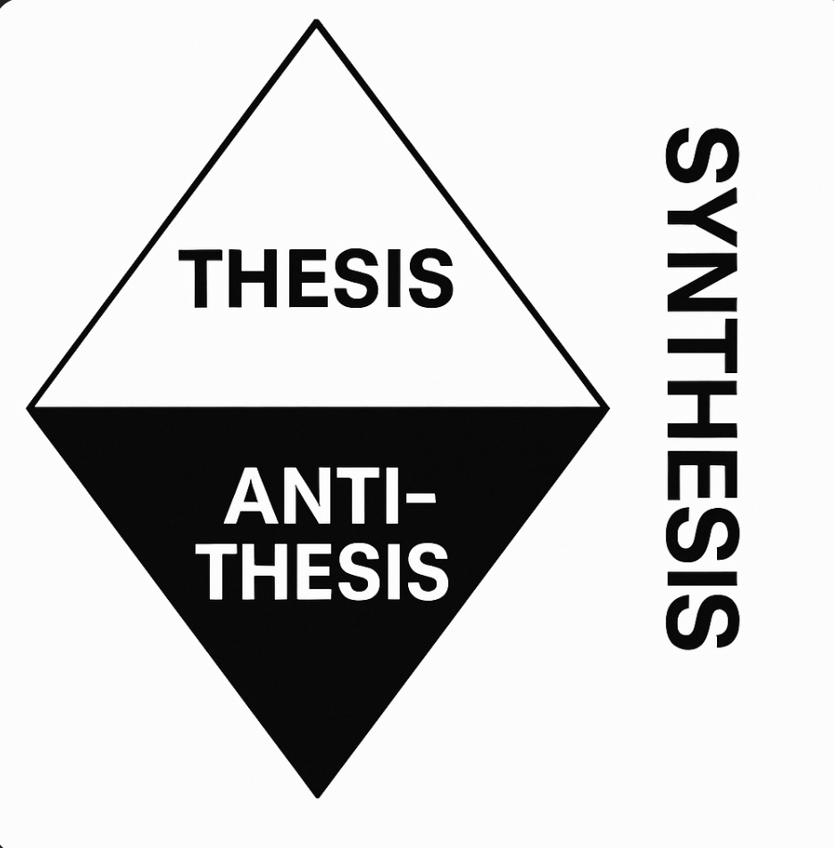

Lozenge is a common symbol in neolythic art such as at Brú na Bóinne.    
This project explores uses and risks of AI models using dialectic reasoning.    
Related to https://github.com/andrekramer/triskelion but separate.    
 
See this substack [post](https://andrekramermsc.substack.com/p/ai-dialectics?r=3wgeou)

Add api keys to files called model-api-key e.g. gemini-api-key for models you initend to use.   

To install:   
source py-install   

To run:   
python prog.py   

Lozenge aims to support a dialectic form of reasoning.   

Put some thesis or prior synthesis into a file called synthesis and run:    
python dialectrician.py    
(the synthesis is saved so you can itterate if Config.synthesis_only from dialectic.py is set to True)   

Install as an MCP (Model Context Protocol) server:    
mcp install dialectic_server.py     

Make sure you add aiohttp as a dependency (see claud_desktop_config.json for claud desktop)   
Add the install location as FILEPATH in support.py or set as an env var in claud_desktop_config.json file.      

Dialectic square and cube: [post](https://andrekramermsc.substack.com/p/we-philosopher-kings)

